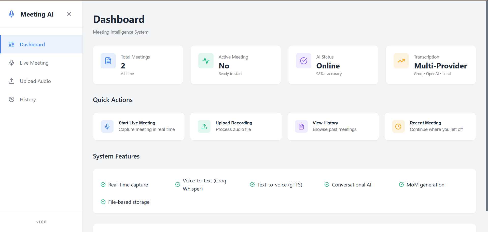
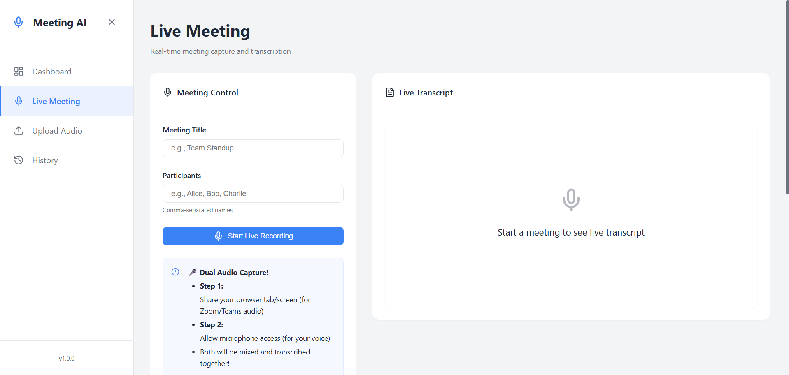
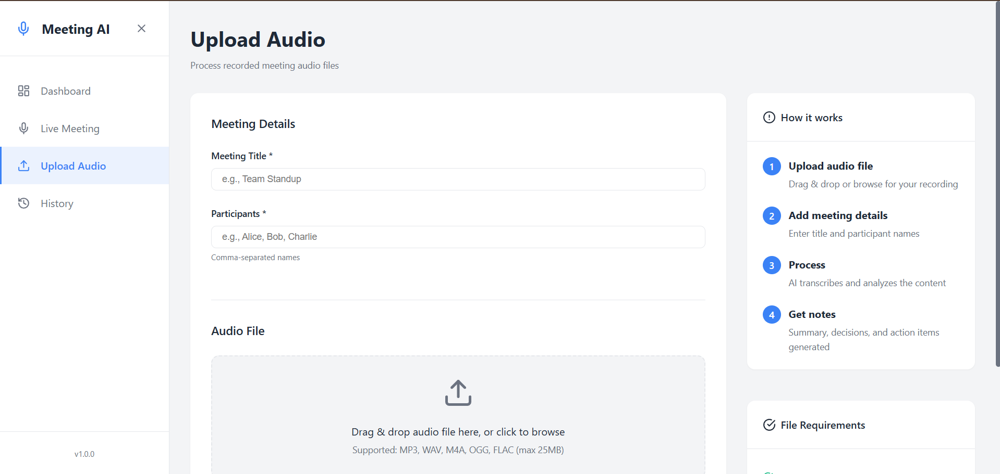
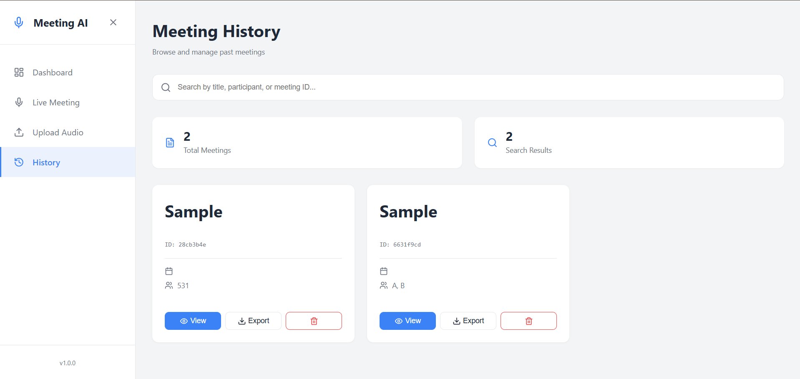

## Screenshots

### API Documentation



### Create Meeting Session



### Add Meeting Transcript



### AI Generated Meeting Insights


# Meeting Intelligence System

An AI-powered meeting assistant that records, transcribes, and summarizes your meetings automatically. It captures both your voice and the system audio simultaneously, so nobody's words get lost — whether you're in Zoom, Teams, or Google Meet.

Built with Python and FastAPI, backed by Groq's Whisper for transcription and LLaMA 3.3 70B for analysis.

---

## What it does

The system handles the full pipeline: dual audio capture → real-time transcription → AI analysis → structured meeting notes. Output includes a plain-English summary, a list of actual decisions made, and action items with owners and deadlines — all in a consistent JSON format your other tools can consume.

The AI is context-aware enough to distinguish between "we decided to use PostgreSQL" and "maybe we should look at PostgreSQL sometime." It filters suggestions, questions, and vague statements so your decision log stays clean.

---

## Getting started

### 1. Install dependencies

```bash
pip install -r requirements.txt
```

### 2. Set up your API key

Create a `.env` file in the project root:

```env
GROQ_API_KEY=your_groq_api_key_here
```

Get a free key at [console.groq.com/keys](https://console.groq.com/keys). You'll also need to enable Whisper models under [Settings → Limits](https://console.groq.com/settings/limits).

### 3. Start the server

```bash
# Windows
start_server.bat

# Linux / macOS
python main.py
```

Server runs at `http://localhost:8000`. Interactive API docs are at `http://localhost:8000/docs`.

### 4. Start recording

```bash
python streaming_meeting.py
```

The script auto-detects your audio devices, starts capturing both your mic and system audio, and transcribes every 10 seconds. When you stop the recording, it generates the full meeting notes.

---

## Example output

Here's what a typical session looks like in the terminal:

```
✅ System Audio: Stereo Mix (Realtek Audio)
✅ Microphone: Microphone Array (Realtek Audio)

🎧 Recording DUAL AUDIO... (capturing ALL voices)

💬 [15:45:23] We decided to use PostgreSQL as our database
----------------------------------------------------------------------
💬 [15:45:35] Alice will complete the setup by Friday
----------------------------------------------------------------------

📊 Audio Level: [████████████░░░░░░░░] 15.3% ✅ GOOD
```

And the final JSON output:

```json
{
  "meeting_id": "abc123",
  "title": "Product Planning",
  "date": "2026-06-12 15:30:00",
  "participants": ["Alice", "Bob", "Charlie"],
  "summary": "Team reviewed the Q3 roadmap and aligned on priorities. PostgreSQL was selected as the database for the new feature, and a September 15th launch target was confirmed. Weekly syncs were scheduled to keep the team coordinated going forward.",
  "key_decisions": [
    "Launch date set for September 15th",
    "Use PostgreSQL for the new feature",
    "Weekly sync every Monday at 10am"
  ],
  "action_items": [
    {
      "task": "Complete API design document",
      "owner": "Alice",
      "deadline": "Friday"
    },
    {
      "task": "Set up database infrastructure",
      "owner": "Bob",
      "deadline": "Next Monday"
    }
  ]
}
```

A human-readable `.txt` version is saved alongside the JSON in the `meeting_notes/` folder.

---

## Other scripts

**`process_my_meeting.py`** — for processing a pre-recorded audio file instead of live input. Edit the file to set the title, participants, and file path before running.

**`test_microphone.py`** — run this before a meeting to confirm your mic is working and at the right level. Shows live audio levels so you can spot issues before they matter.

---

## Architecture

```
┌─────────────────────────────────────────────────────────────┐
│                      FastAPI Server                         │
│                        (main.py)                            │
│  21 API Endpoints: /meeting/*, /chat/*, /transcribe/*      │
└─────────────────────────────────────────────────────────────┘
                              │
            ┌─────────────────┴─────────────────┐
            │                                   │
┌───────────▼──────────┐            ┌──────────▼───────────┐
│   AI Service         │            │  Meeting Manager     │
│  (ai_service.py)     │            │ (meeting_manager.py) │
│                      │            │                      │
│ • LLaMA 3.3 70B      │            │ • State Management   │
│ • Context-Aware      │            │ • Session Tracking   │
│ • Multi-Pass Analysis│            │ • Notes Storage      │
└──────────┬───────────┘            └──────────────────────┘
           │
    ┌──────┴──────┐
    │             │
┌───▼────┐   ┌───▼────────────┐
│Transcr.│   │   Analyzers    │
│Service │   │                │
│        │   │ • Decisions    │
│Groq /  │   │ • Action Items │
│OpenAI /│   │ • Confidence   │
│Local   │   │ • Deduplication│
└────────┘   └────────────────┘
```

### File layout

```
Meeting/
├── main.py                      # FastAPI server + all endpoints
├── ai_service.py                # AI orchestration (prompts, analysis)
├── transcription_service_v2.py  # Groq / OpenAI / local Whisper
├── meeting_manager.py           # Session lifecycle and state
├── file_storage.py              # Saves JSON and TXT output
├── schemas.py                   # Pydantic models
├── config.py                    # Config and env vars
├── analyzers.py                 # Decision and action item extraction
├── meeting_intelligence.py      # Meeting type detection
├── utilities.py                 # Text helpers
│
├── streaming_meeting.py         # Live transcription tool
├── process_my_meeting.py        # Offline recording processor
├── test_microphone.py           # Mic diagnostics
│
├── audio_level_monitor.py       # Real-time audio monitoring
├── requirements.txt
├── .env.example
├── start_server.bat
│
└── meeting_notes/               # All saved meetings (JSON + TXT)
```

---

## Transcription providers

Groq Whisper is the default — it's fast, free on the generous tier, and accurate. If it's unavailable, the system falls back to OpenAI Whisper automatically. A local Whisper option is also available if you need offline processing or want to keep audio off the network entirely.

---

## Tips for better results

The AI works with what the transcript gives it. Vague audio leads to vague notes. A few habits that make a noticeable difference:

- Say names when assigning tasks: "Bob will handle the setup" beats "someone should do that"
- State deadlines explicitly: "by end of Friday" is better than "soon"
- Use clear decision language: "we agreed to..." or "the team decided..." signals a real decision vs. a passing comment
- Keep your mic volume at 100% with +30dB boost (see troubleshooting below if you're not sure how)

---

## Troubleshooting

### Microphone showing 0.0% audio level

```
📊 Audio Level: [░░░░░░░░░░░░░░░░░░░░] 0.0% ❌ VERY LOW
```

On Windows, check: **Settings → Privacy & Security → Microphone**, and make sure both "Microphone access" and "Let desktop apps access your microphone" are enabled.

Then: right-click the speaker icon → Sounds → Recording tab → select your mic → Properties → Levels → set Microphone to **100** and Microphone Boost to **+30dB**.

Run `python test_microphone.py` — you should see levels above 500 while speaking.

### PortAudio initialization error

```
❌ Failed to initialize audio: [Errno -10000] PortAudio not initialized
```

Close any apps using audio (Zoom, Teams, Discord, browser tabs with audio), wait 10 seconds, and try again. If that doesn't work, a restart usually clears it.

### Whisper models blocked

```
model blocked at organization level
```

Go to [console.groq.com/settings/limits](https://console.groq.com/settings/limits) and enable Whisper models. Alternatively, configure OpenAI Whisper or local Whisper as a fallback in your `.env`.

---

## Configuration

### Environment variables

```env
# Required
GROQ_API_KEY=your_groq_api_key

# Optional fallbacks
OPENAI_API_KEY=your_openai_api_key
ASSEMBLYAI_API_KEY=your_assemblyai_api_key
HUGGINGFACE_TOKEN=your_hf_token
```

### Audio defaults (in `streaming_meeting.py`)

| Setting | Value |
|---|---|
| Chunk size | 1024 samples |
| Format | 16-bit PCM |
| Channels | 2 (stereo) |
| Sample rate | 44100 Hz |
| Transcription interval | Every 10 seconds |

---

## API endpoints

```
POST /meeting/start
POST /meeting/stop
GET  /meeting/{meeting_id}
POST /meeting/input
POST /meeting/input/audio

POST /transcribe/audio
POST /transcribe/file

POST /chat
POST /chat/voice
POST /chat/tts
```

Full interactive documentation available at `http://localhost:8000/docs` when the server is running.

---

## Security notes

API keys stay in `.env` and never get committed to version control. Audio is processed locally — only the transcription step sends data externally (to Groq or OpenAI, depending on your config). Meeting notes are stored locally in `meeting_notes/`.

For production deployments, you'll want to add authentication to the API endpoints, enable HTTPS, and consider encrypting stored notes if meetings contain sensitive content.

---

## Roadmap

- Speaker identification (attribute quotes to specific people)
- Multi-language support
- Meeting sentiment analysis
- Calendar app integration
- Slack / Teams bot
- Real-time collaborative editing of generated notes

---

## Dependencies

- `fastapi` — web framework
- `groq` — Groq API client
- `pydantic` — data validation
- `pyaudio` — audio capture
- `numpy` — audio processing
- `openai` — OpenAI Whisper fallback (optional)
- `whisper` — local transcription (optional)
- `gtts` — text-to-speech (optional)

```bash
pip install -r requirements.txt
```

---


## License

These project can be used for educational purpose